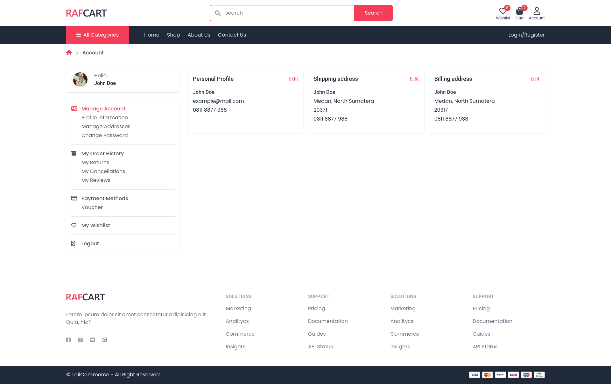
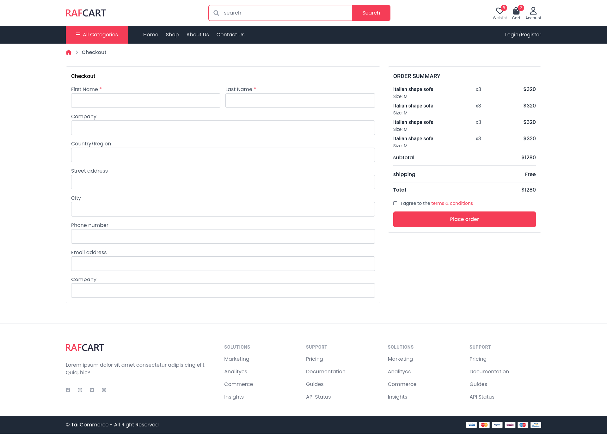
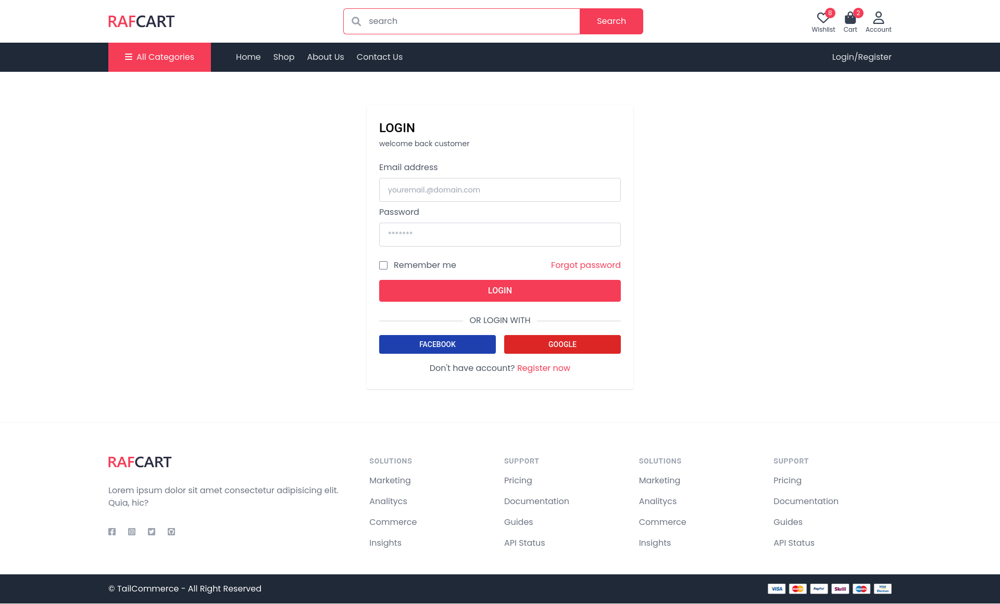
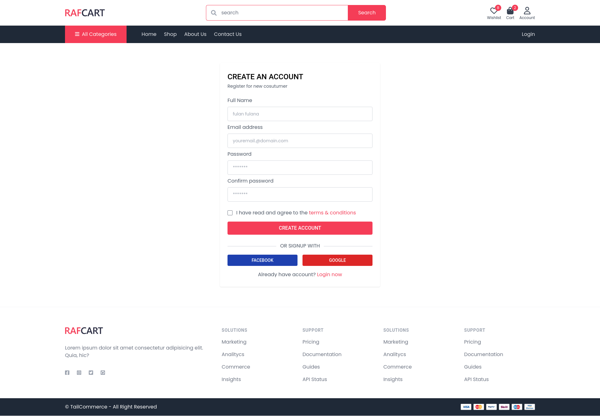
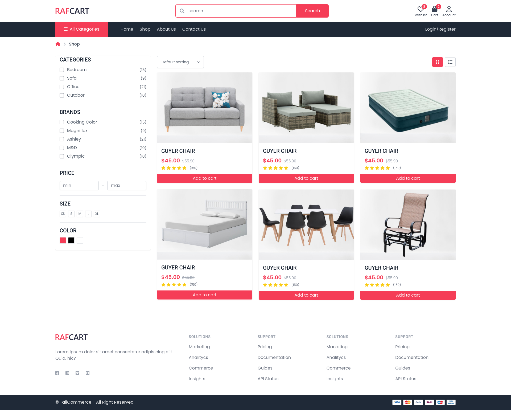
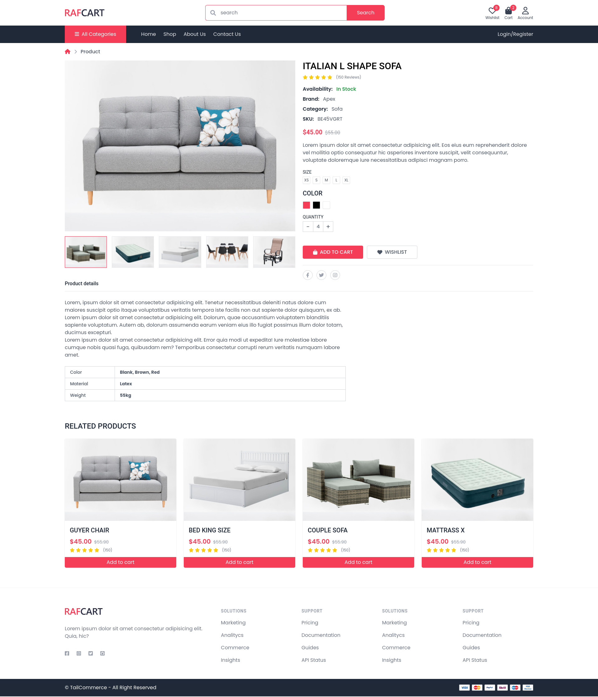
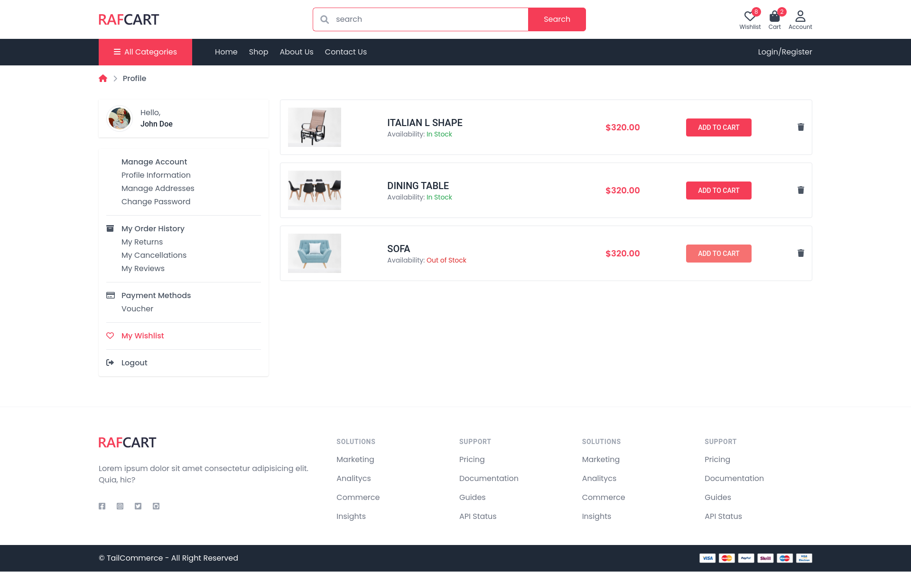

<br/>
<p align="center">
  <h3 align="center">Ecommerce Tailwind Template</h3>

  <p align="center">
    an ecommerce template using tailwind css v3
    <br/>
    <br/>
  </p>
</p>


## About The Project


Ecommerce Tailwind project.

## Screenshots
<details>
<summary>Homepage</summary>


</details>

<details>
<summary>Account</summary>


</details>

<details>
<summary>Checkout</summary>


</details>

<details>
<summary>Login</summary>


</details>

<details>
<summary>Register</summary>


</details>

<details>
<summary>Shop</summary>


</details>

<details>
<summary>Product</summary>


</details>

<details>
<summary>Wishlist</summary>


</details>

## Prerequisites

This is an example of how to list things you need to use the software and how to install them.

* npm

```sh
npm install npm@latest -g
```

### Installation

1. Clone the repo

```sh
git clone https://github.com/fajar7xx/ecommerce-template-tailwind-1
```

2. Install NPM packages

```sh
npm install
```

3. run npm watch

```sh
npm run watch
```

## Usage

Use this space to show useful examples of how a project can be used. Additional screenshots, code examples and demos work well in this space. You may also link to more resources.

_For more examples, please refer to the [Documentation](https://example.com)_

## Roadmap

See the [open issues](https://github.com/fajar7xx/ ecommerce-template-tailwind-1/issues) for a list of proposed features (and known issues).

## Contributing

Contributions are what make the open source community such an amazing place to be learn, inspire, and create. Any contributions you make are **greatly appreciated**.
* If you have suggestions for adding or removing projects, feel free to [open an issue](https://github.com/fajar7xx/ ecommerce-template-tailwind-1/issues/new) to discuss it, or directly create a pull request after you edit the *README.md* file with necessary changes.
* Please make sure you check your spelling and grammar.
* Create individual PR for each suggestion.
* Please also read through the [Code Of Conduct](https://github.com/fajar7xx/ ecommerce-template-tailwind-1/blob/main/CODE_OF_CONDUCT.md) before posting your first idea as well.

### Creating A Pull Request

1. Fork the Project
2. Create your Feature Branch (`git checkout -b feature/AmazingFeature`)
3. Commit your Changes (`git commit -m 'Add some AmazingFeature'`)
4. Push to the Branch (`git push origin feature/AmazingFeature`)
5. Open a Pull Request

## Authors

* **Fajar Siagian** - *Fullstack Developer* - [Fajar Siagian](https://github.com/fajar7xx/) - *author*

